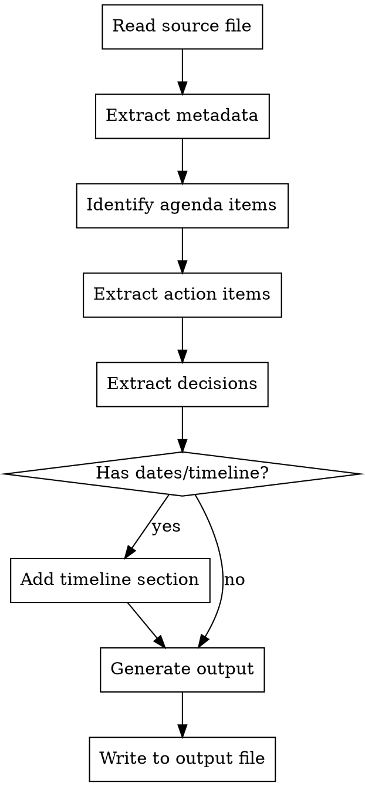

# Convert Meeting Notes

## Overview

러프하게 작성된 회의록 메모를 일관된 구조의 회의록 문서로 변환한다. 원본에 있는 정보만 정리하며, 없는 정보를 추측하지 않는다.

## Input/Output

**입력:** 소스 파일 경로 (회의록 메모)와 선택적 출력 파일명

```
입력: <소스파일경로> [출력파일명]
```

**출력 파일명 규칙:**
- 명시적으로 지정된 경우: 그대로 사용
- 미지정 시 기본값: `{소스파일명}_convert.md`
  - 예: `meeting_0429.txt` → `meeting_0429_convert.md`
  - 예: `회의메모.md` → `회의메모_convert.md`

## Process



## Output Template

아래 템플릿의 각 섹션은 **원본에 해당 정보가 있을 때만** 포함한다. 빈 섹션은 생성하지 않는다.

```markdown
# [회의 제목]

## 회의 정보
| 항목 | 내용 |
|------|------|
| 일시 | YYYY-MM-DD (요일) HH:mm |
| 참석자 | 이름1, 이름2, ... |
| 장소 | (있을 경우만) |

## 안건

### 1. [안건 제목]
- 논의 내용 요약
- **결정사항:** (결정이 있을 경우만)
- **담당자:** (지정된 경우만)
- **기한:** (명시된 경우만)

### 2. [안건 제목]
...

## Action Items
| 항목 | 담당자 | 기한 | 비고 |
|------|--------|------|------|
| 작업 내용 | 이름 | 날짜 (명시된 경우만) | |

## 주요 일정
- **YYYY-MM-DD**: 일정 내용

## 다음 회의
- 일시: YYYY-MM-DD (요일) HH:mm
```

## Critical Rules

### 원본 충실 원칙
- **원본에 없는 정보를 추가하지 않는다** — 마감일, 우선순위, 상태 등을 추측하지 않음
- **원본에 없는 섹션을 만들지 않는다** — "Blockers", "Risks" 등 원본에 근거 없는 섹션 금지
- 불명확한 내용은 원문 그대로 옮기거나 `[확인 필요]` 표기

### 날짜 처리
- 원본의 날짜를 ISO 형식(YYYY-MM-DD)으로 정규화
- 요일은 괄호 안에 표기: `2026-04-29 (화)`
- **원본에 명시되지 않은 날짜를 추론하지 않는다**

### 언어
- 원본의 언어를 유지한다 (한국어 메모 → 한국어 회의록)
- 섹션 제목도 원본 언어에 맞춘다

## Common Mistakes

| 실수 | 올바른 방법 |
|------|------------|
| 원본에 없는 마감일 추론 | 명시된 기한만 기재 |
| 빈 섹션 생성 | 해당 정보 없으면 섹션 자체를 생략 |
| 원본에 없는 "우선순위" 컬럼 추가 | 원본에 우선순위 언급 있을 때만 포함 |
| 과도한 섹션 분리 (Risks, Blockers 등) | 원본 구조에 맞게 최소 섹션 유지 |
| 원본 내용을 재해석/의역 | 핵심 의미를 유지하되 원문에 충실 |
